## 0. 背景

希望你在动手之前，能充分了解一下 终端、Terminal、Shell、Bash、Zsh、Oh My Zsh、PowerShell、Windows Terminal 这些概念，
这些概念，尤其是作为一个开发者，这些应用层面的东西，如果这是一步一步照着教程做，而不知道为什么这么做，甚至连这个东西是干什么的，那么你的收获可能会很少。

**终端（Terminal）**：在计算机的早期阶段，终端是指物理设备，例如电传打字机或显示器，用于与计算机进行交互。用户通过终端输入命令，计算机则执行这些命令并返回结果。

**Shell**：最初的Shell是一个简单的解释器程序，负责接收用户的命令并将其传递给操作系统执行。最早的Shell是Bourne Shell（sh），它由Steve Bourne开发，并成为UNIX系统的标准Shell。

<font color=red>总结，终端最初是指一个物理设备，Shell是一个程序，负责接收用户的命令并将其传递给操作系统执行。</font>

> 随着计算机的发展终端和shell的概念逐渐淡化了，现在我们通常把终端和shell混在一起说，比如说Windows Terminal、iTerm、Hyper等等，这些都是终端，但是他们都有自己的Shell，比如说Windows
> Terminal默认的Shell是PowerShell，iTerm默认的Shell是Bash，Hyper默认的Shell是Zsh。

## 1. 安装Windows Terminal

了解了以上概念，我们就可以开始了，所以你当然可以选择安装使用其他虚拟终端工具，比如很火的Hyper等

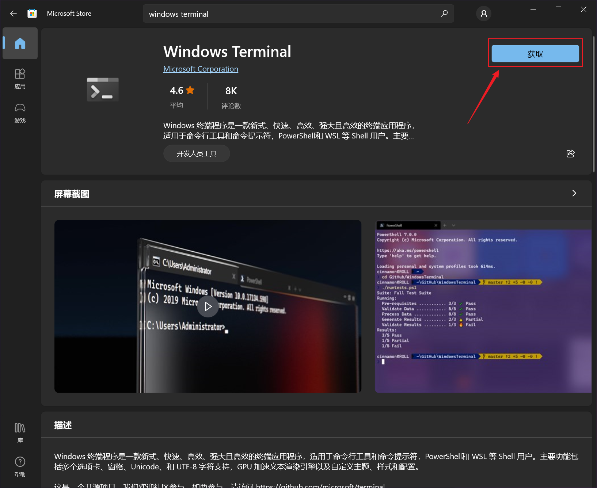

安装完成后，我们打开Windows Terminal，可以看到默认的Shell是PowerShell，这个Shell是Windows自带的，功能很强大。

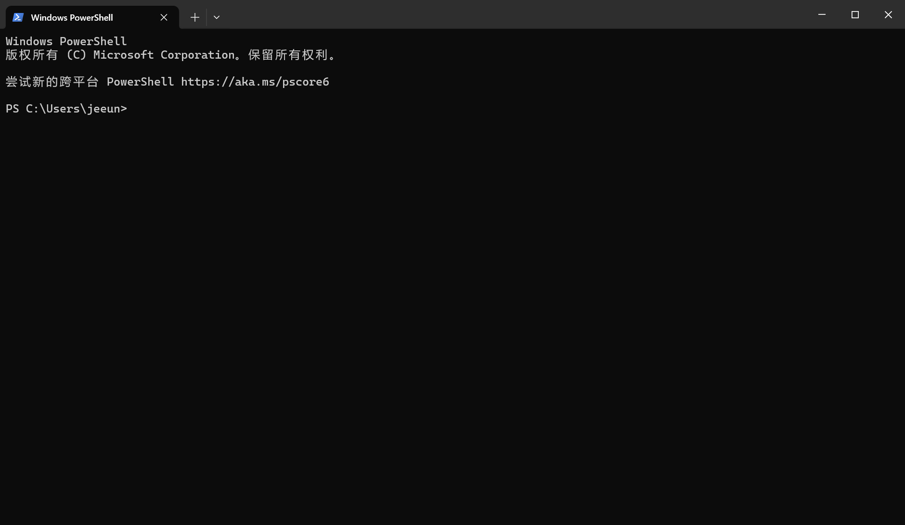

> 此时，回顾我们前面的内容，Windows Terminal是一个终端，PowerShell是一个Shell，Windows Terminal默认的Shell是PowerShell。

从设置界面也可以看出，Windows Terminal支持多个Shell，我们可以在这里添加或设置默认的 Shell。
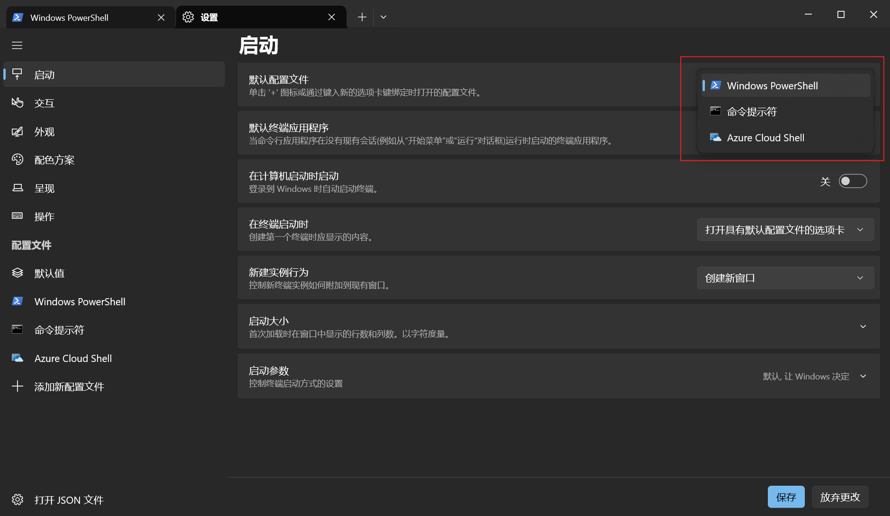

## 2. 安装Powershell

不出意外的还，你的windows 已经默认安装了powershell，当然也可以下载安装最新的 powershell 7。

[下载地址](https://learn.microsoft.com/zh-cn/powershell/scripting/install/installing-powershell-on-windows?view=powershell-7.4#installing-the-zip-package)

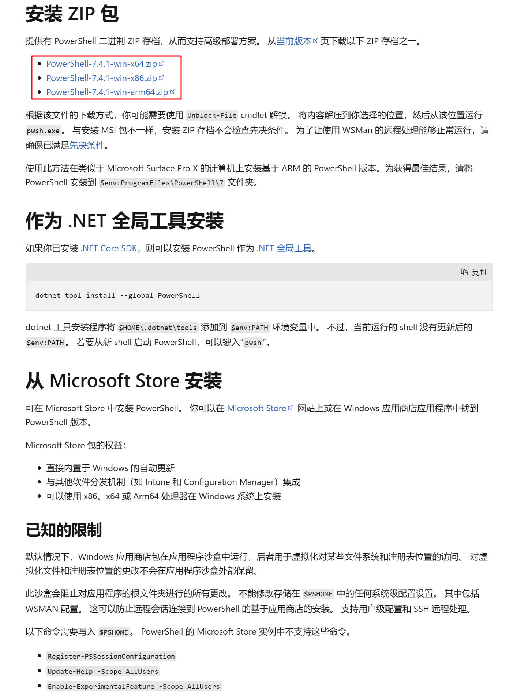

## 3. 下面让我们动手开始安装 oh my posh

搞清楚了Terminal、Shell,我们动手开始安装 oh my posh 之前，也首先要了解一下 oh my posh 是什么。
用过mac的同学应该都知道 oh my zsh，我们先从名字理解，他是一个zsh的配置工具，可以让你的终端更好看，oh my posh 也是一个配置工具，可以让你的powershell更好看。
> 不过oh my posh官网上说，oh my posh是一个支持任意Shell的工具，所以你也可以用oh my posh来配置你的bash、zsh等等。我也把他装在了我windows wsl的ubuntu bash上面。
> 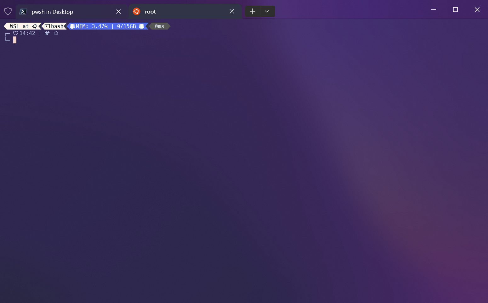

好了，我们开始安装 oh my posh................

oh my posh的安装非常简单。打开oh my posh的官网，[oh my posh](https://ohmyposh.dev/)

来到Get started ==》Installation =》Windows：
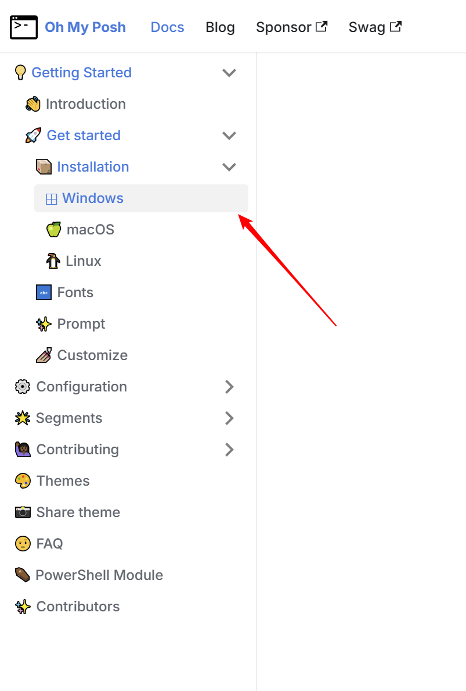

可以看到，官网为我们提供了 4 中安装方式：
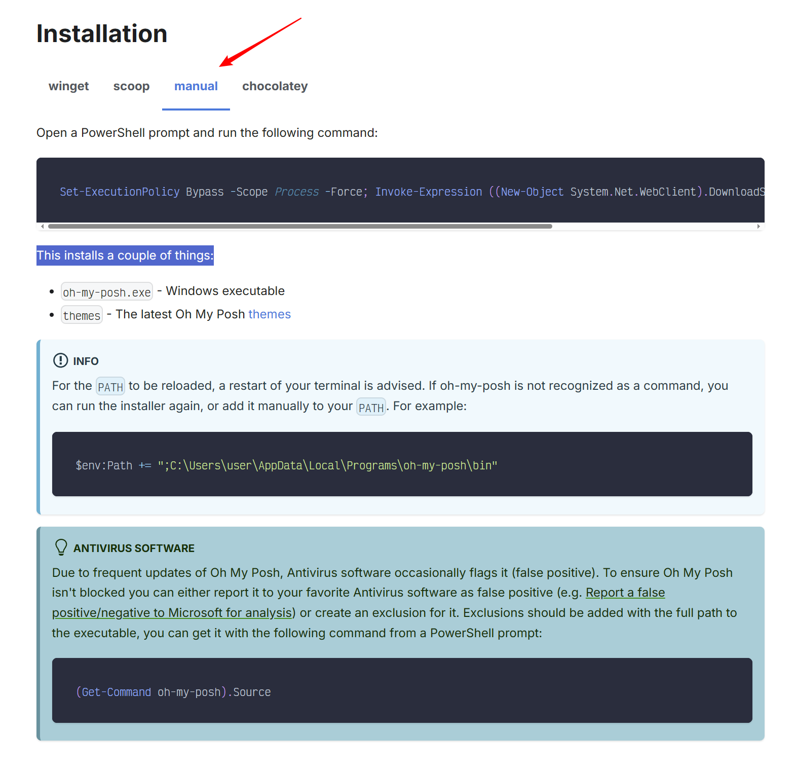

我们这里使用 manual 方式安装，复制命令到powershell中执行即可：

```shell
Set-ExecutionPolicy Bypass -Scope Process -Force; Invoke-Expression ((New-Object System.Net.WebClient).DownloadString('https://ohmyposh.dev/install.ps1'))
```

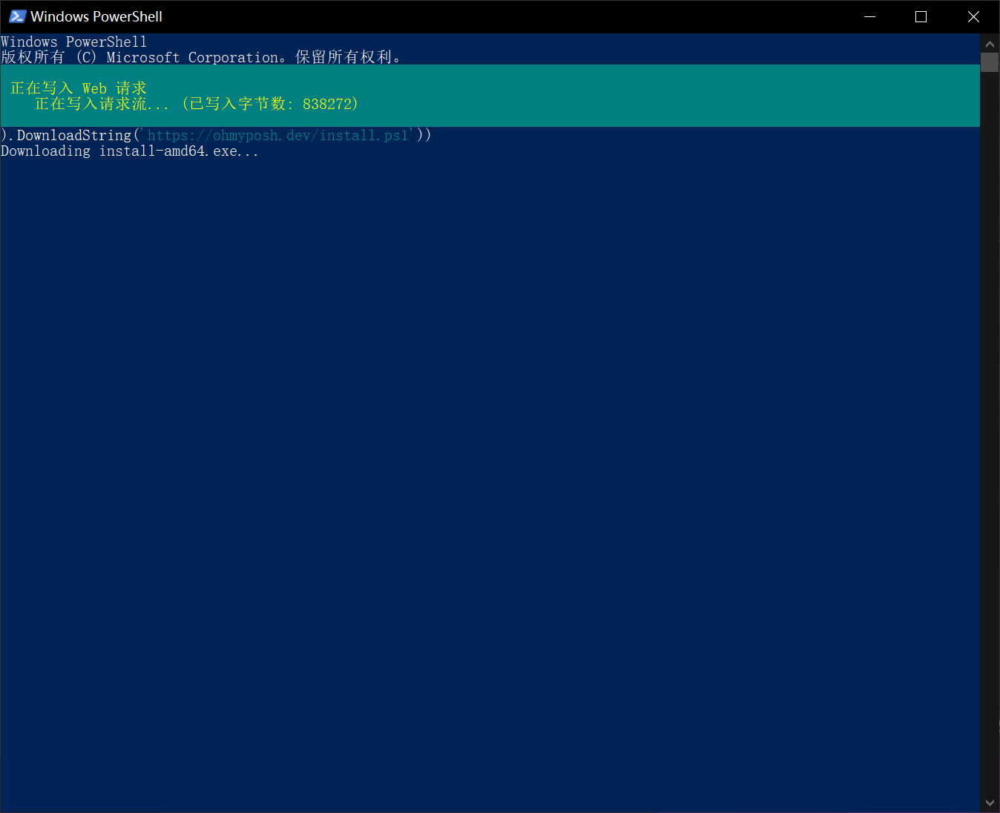
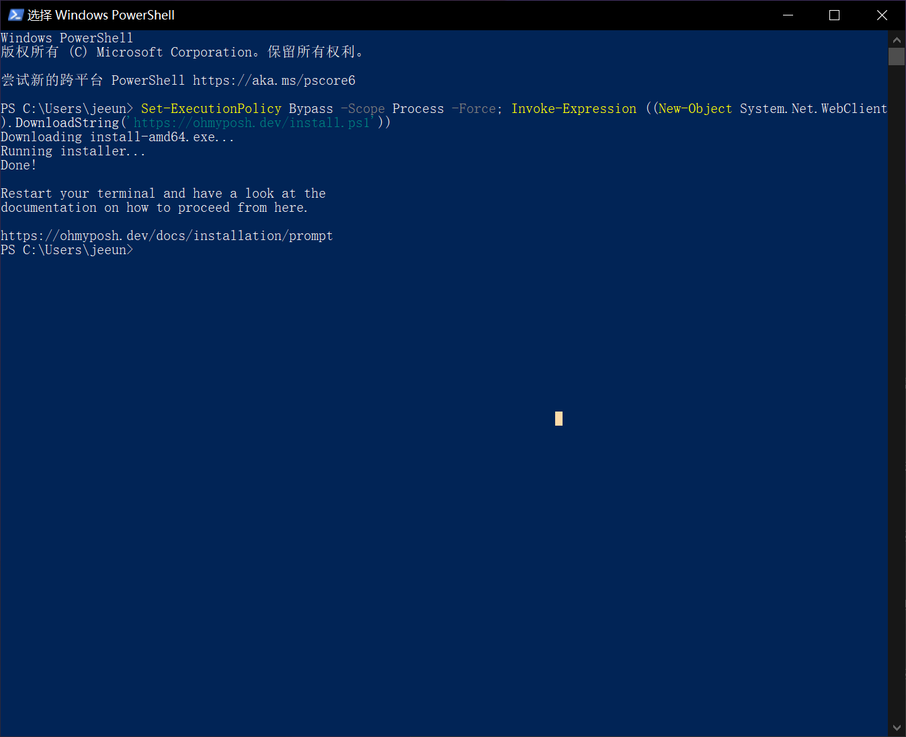
安装完成

什么？ 完全没变化，不要着急，我们开始为oh my posh做一些配置：
重启powershell

来到官网的prompt页面
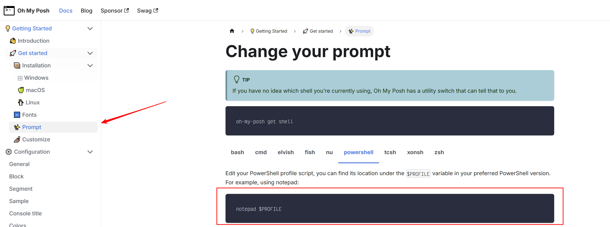

这里 ``` notepad $PROFILE ```   的意思是用记事本打开 $PROFILE 这个配置文件，这个文件是powershell的配置文件，我们可以在这里配置oh my posh的主题等等。

我们选择使用 vscode打开这个文件，这样我们可以更方便的编辑这个文件。

```shell
code $PROFILE
```

如果你之前没有配置过powershell，那么这个文件是不存在的，没关系，这时会打开一个新文件，编辑完直接保存即可。
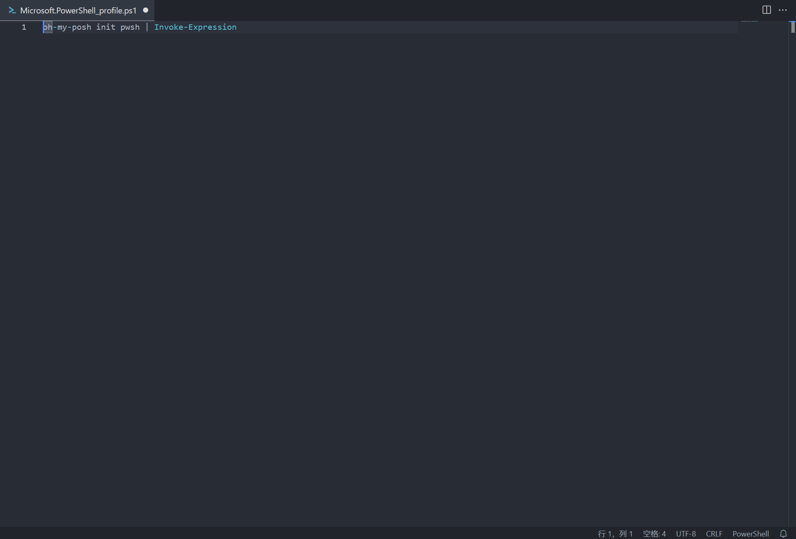

在配置文件中输入一下内容保存：

```shell
oh-my-posh init pwsh | Invoke-Expression
```

重启powershell

如果你看到以下报错
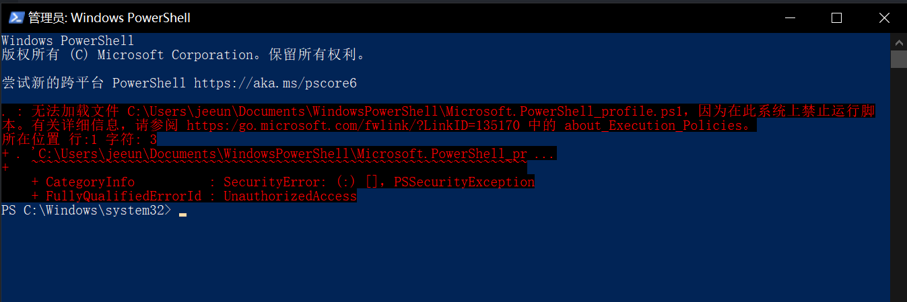

那么你需要以管理员身份运行powershell，然后执行以下命令：

```shell
set-executionpolicy remotesigned
```

> Set-ExecutionPolicy RemoteSigned 的意思是修改执行策略，RemoteSigned 表示只要是本地的脚本可以不受限制的运行，但是从网络上下载的脚本需要带有数字签名才能运行。

重启 powershell 不出意外的话，你的powershell已经有变化了：
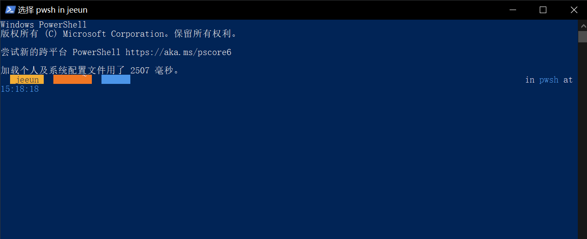

什么 What is this ? 字都看不清了，什么玩意儿？
这是因为我们本地没有安装字体，oh my posh的主题需要特定的字体支持，我们需要安装这个字体。

官网推荐我们安装 MesloLGM Nerd Font 字体，[下载地址](https://www.nerdfonts.com/)

这里我们去挂网下载并安装字体
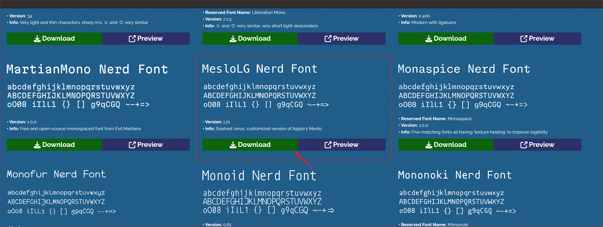

解压全选 右键安装即可
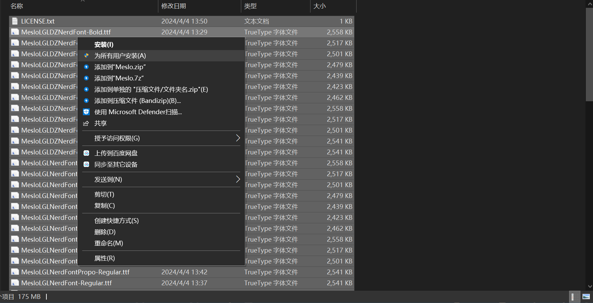

下面我们使用 windows terminal 打开 powershell，在 windows terminal 中设置字体为 MesloLGM Nerd Font 字体
使用快捷键 ```ctrl + shift + ,``` 打开设置界面，搜索 font ，找到 fontFace 选项，设置为 MesloLGM Nerd Font 字体

在 profiles defaults 中设置默认字体:

```json
 "font":
{
"face": "MesloLGM Nerd Font"
}
```

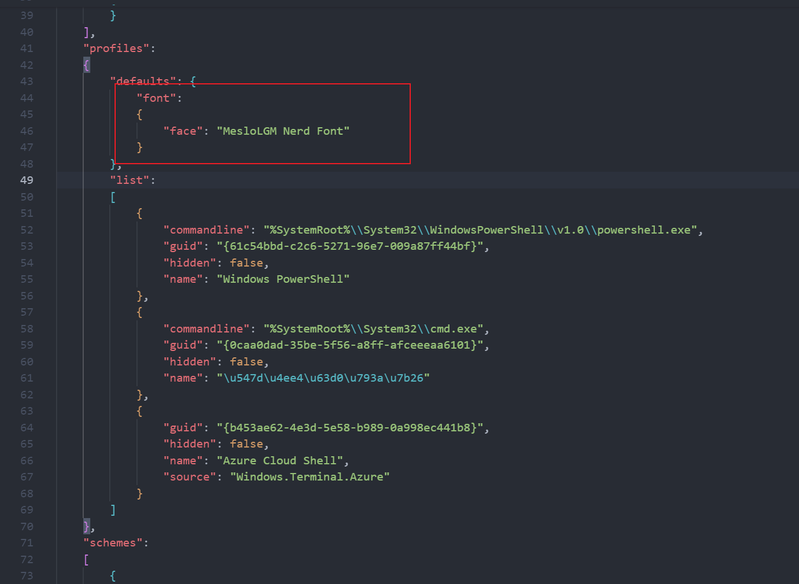

保存重启 windows terminal,可以看到显示已经变正常了
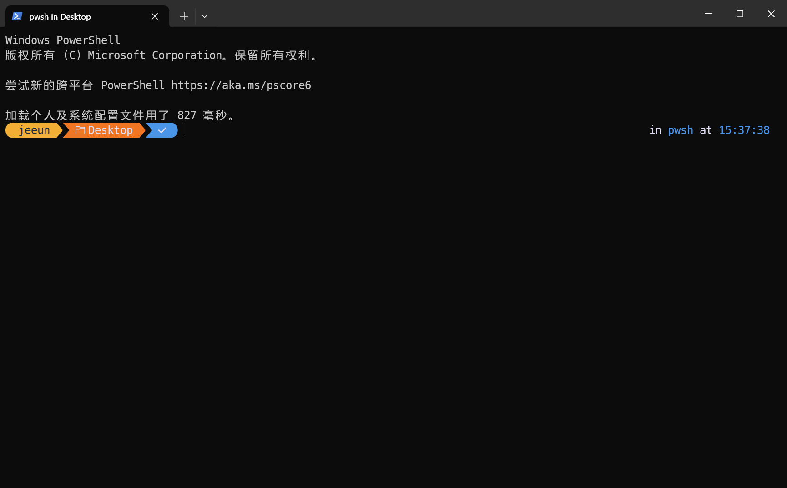

到此，我们的配置工作已经做完了，为了让你的终端更好看，还可以做以下配置：

## 配置主题

oh my posh 提供了很多主题，你可以在官网的prompt页面查看所有主题，选择一个你喜欢的主题，然后在配置文件中修改主题即可。
运行以下命令，可以看到并预览所有主题：

```shell
Get-PoshThemes
```

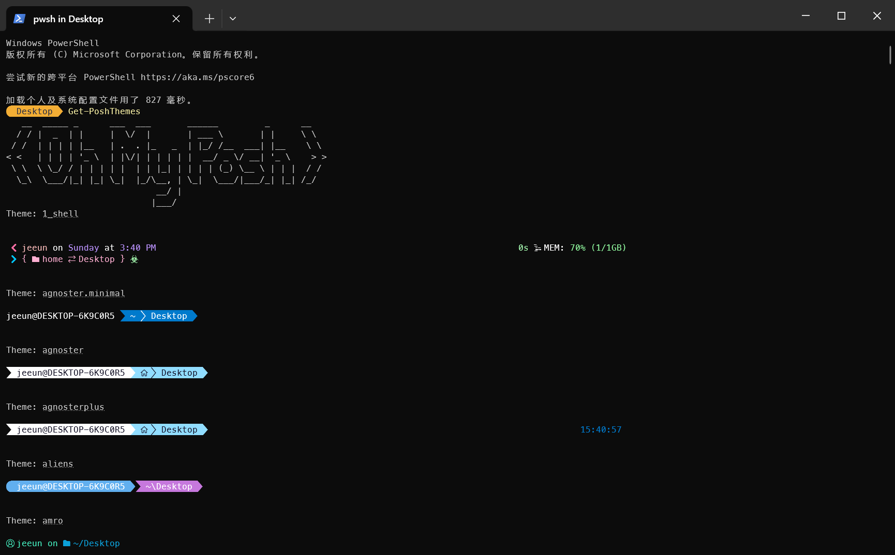

可以看到，输出最后给出了所有主题保存的位置，并告诉我们如何修改主题。
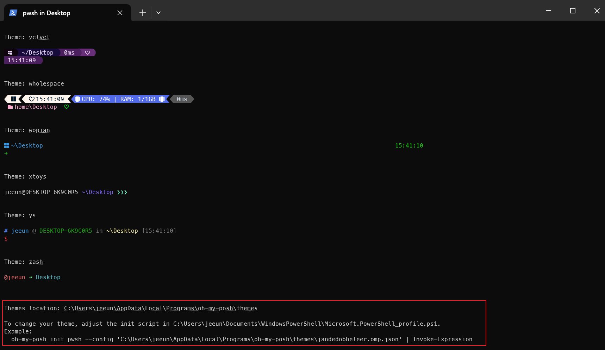

再次打开 $PROFILE 文件，挑选一个我们喜欢的主题，把主题所在目录复制到配置文件中即可。
以 gmay 这个主题为例

```shell
oh-my-posh init pwsh --config 'C:\Users\jeeun\AppData\Local\Programs\oh-my-posh\themes\gmay.omp.json' | Invoke-Expression
```

> 注意主题路径一定要替换成你自己的目录
>
重启 windows terminal 可以看到，主题已经变成了 gmay
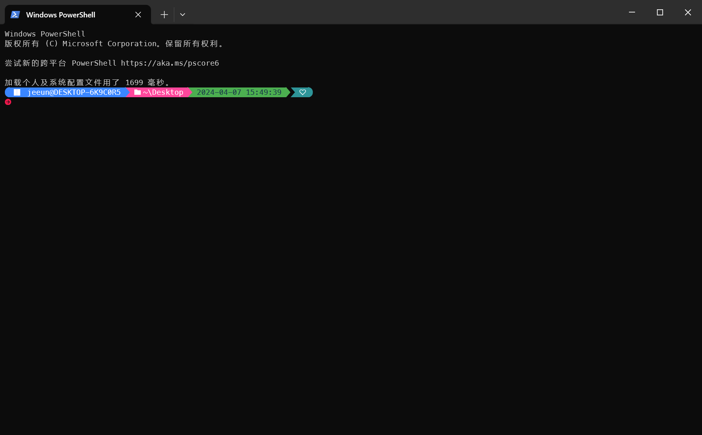

## Windows terminal 配置

我们还可以对 windows terminal 进行一些配置，比如说更换主题、更换背景等等。

再次来看看 windows terminal 的这个配置文件，我们刚刚通过在 profiles defaults 配置修改了 windows terminal 的默认字体，我们可以在这里配置更多的内容。

profiles 下面有 defaults 和 list
defaults 是默认配置，配置 windows terminal 打开所有的终端都会使用这个配置，list则是针对每个终端的配置。

详细配置可以参考官网文档：[Windows Terminal](https://docs.microsoft.com/zh-cn/windows/terminal/)

这里我列出来我自己的 defaults 配置，仅供大家参考

```json
{
  "antialiasingMode": "cleartype",
  /*抗锯齿模式*/
  "colorScheme": "Tango Dark",
  /*配色方案*/
  "cursorShape": "filledBox",
  /*光标形状*/
  "font": {
    "face": "MesloLGM Nerd Font",
    "size": 8.0
  },
  "opacity": 65,
  /*透明度*/
  "useAcrylic": true
  /*使用亚克力效果*/
}
```

最终的效果：

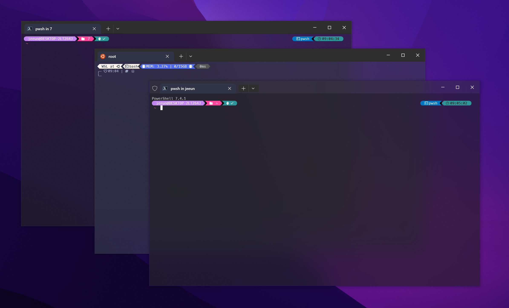

另外，windows terminal 还支持很多自定义大家可以去探索，比如配色方案，主题效果等，大家可以到gitHub 去找一些配置文件，然后替换自己的配置文件，这样可以让你的终端更加个性化。
